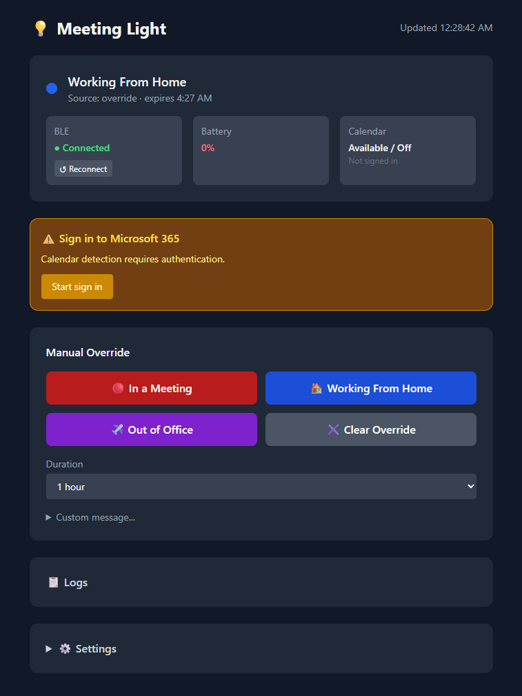
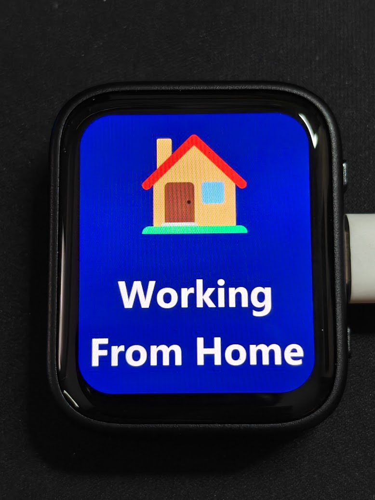

# Meeting Light
A professional office status display for a Waveshare ESP32-C6 1.8" Touch AMOLED, mounted in an office window. Shows your current status — In a Meeting, Working From Home, Out of Office, or a custom message — to coworkers passing by.

<p align="center">
  
  
</p>

## How It Works

A mini PC at your desk polls your Outlook calendar via the Microsoft Graph API and pushes status updates to the ESP32 over BLE. A web UI (accessible remotely via Tailscale) lets you set manual overrides, compose custom messages with emoji, and preview what will appear on screen before sending.

```
ESP32-C6 AMOLED  <──BLE──>  Mini PC Service  <──Graph API──>  Microsoft 365
                                   │
                             Web UI :8080  <──Tailscale──  Remote access
```

## Features

- **Automatic detection** — polls Outlook or Google calendar for meetings, WFH location, and Out of Office status
- **Emoji + text display** — full-resolution images rendered service-side with any emoji and custom text, transferred to the display over BLE
- **Full emoji picker** — pick any emoji from the web UI; no pre-compilation required
- **Preview before send** — see exactly what will appear on screen, with font size +/− controls
- **Manual overrides** — preset buttons (In a Meeting, WFH, OOF) or custom message with background color and emoji
- **Override expiry** — set duration (30 min, 1 hr, end of day, etc.) before reverting to calendar state
- **Boot button controls** — tap to cycle through preset states; hold 3 seconds to reboot
- **Boot splash** — shows a 💡 Meeting Light logo on startup while connecting to the service
- **Waiting to Connect screen** — after the splash, shows a Bluetooth logo and the device's BLE MAC address so multiple units can be identified and configured
- **Per-device BLE name** — each device advertises as `MeetingLight-XXXX` (last 2 MAC bytes) for easy identification in BLE scanners and the service UI
- **Battery-safe deep sleep** — on battery power, sleeps and wakes every 2 minutes to advertise; never sleeps when USB is connected
- **Business hours scheduling** — device sleeps outside M–F 9–5; configurable in the web UI
- **Power monitoring** — live battery %, voltage, charging state, and USB power detection reported via BLE; dashboard shows USB Powered, Charging, or battery % as appropriate
- **Brightness control** — adjustable in Settings, applied immediately to the device
- **Real-time log panel** — connection and transfer logs visible in the web UI
- **Remote access** — web UI accessible via Tailscale from anywhere

## Display States

| State | Emoji | Background |
|-------|-------|------------|
| In a Meeting | 🔴 | Red |
| Working From Home | 🏠 | Dark blue |
| Out of Office | ✈️ | Dark purple |
| Custom | Any emoji | Any color |
| Off | — | Screen off |

## Hardware

- [Waveshare ESP32-C6 Touch AMOLED 1.8"](https://www.waveshare.com/esp32-c6-touch-amoled-1.8.htm) — 368×448 AMOLED, BLE 5, two hardware buttons, LiPo connector
- Always-on mini PC at desk (Raspberry Pi, mini PC, etc.)
- 3000mAh LiPo battery, swappable; device deep-sleeps and wakes every 2 minutes to check for a connection

### Button Controls

The device has two buttons — **BOOT** (side) and **PWR** (side):

| Gesture | Action |
|---------|--------|
| Tap BOOT | Cycle through Off → In a Meeting → WFH → Out of Office |
| Hold BOOT 3s | Reboot device |

## Enclosure

A two-piece 3D-printed case (designed in Fusion 360). Print files are in `enclosure/`:
`MeetingLight-Enclosure.3mf` (both parts, ready to import into Bambu Studio / PrusaSlicer) and individual STLs in `enclosure/stl/`.

- **Front Lid** — holds the screen and PIR sensor, and frames a paper name-plate insert. The display window is a **flush recess** so the raised cover glass sits level with the front face; a small countersunk aperture exposes the PIR's field of view without a large hole.
- **Back Tray** — holds the LiPo battery (retained by mid-edge ribs that keep the corners clear for the battery's JST wire) and mounts to a window with a command strip.
- **Joint** — the lid presses onto the tray with a self-aligning rabbet lip and snap-in detents (bumps on the lid that click into pockets in the tray walls). No screws; pops off by hand for battery swaps.
- **Overall size** — ~202 × 50 × 17 mm.

**Printing:** orient each part **standing on its end (long axis vertical)** to print without supports — the rabbet, pockets, and screen recess are all designed for that orientation. PLA/PETG, 0.2 mm layers. Detent strength is tunable: if the lid is too stiff or too loose, adjust the bump height slightly and re-export.

## Project Structure

```
firmware/       # ESP32-C6 firmware (PlatformIO + Arduino)
service/        # Mini PC service (Python + FastAPI + Docker)
enclosure/      # 3D-printed two-piece case (STL + 3MF, designed in Fusion 360)
docs/           # Architecture plan and documentation
```

## Getting Started

### Windows USB Driver Note

The ESP32-C6 uses a built-in USB-Serial/JTAG controller. On Windows, if the device doesn't appear as a COM port, install the [ESP32 board support package in Arduino IDE](https://docs.espressif.com/projects/arduino-esp32/en/latest/installing.html) which installs the correct Windows USB drivers. A reboot is required after installation.

### Firmware

Requires [PlatformIO](https://platformio.org/) with the [pioarduino](https://github.com/pioarduino/platform-espressif32) platform fork for ESP32-C6 Arduino support. The easiest approach is the PlatformIO VS Code extension.

```bash
cd firmware
pio run                          # build
pio run -t upload --upload-port COM9   # flash via USB-C (adjust port)
```

To regenerate the pre-compiled preset and boot splash images (run from repo root after changing the service rendering):
```bash
python firmware/tools/gen_preset_images.py   # In a Meeting, WFH, OOF
python firmware/tools/gen_boot_splash.py     # Boot splash
```
Then reflash the firmware.

### Service

#### Prerequisites

- Python 3.11 or newer
- Bluetooth adapter (built-in or USB dongle)
- On Windows: no extra drivers needed; on Linux: `bluez` must be installed (`sudo apt install bluez`)

#### 1. Copy and edit `.env`

```bash
cd service
cp .env.example .env
```

Open `.env` and fill in your values — everything here is passed as environment variables to the container by `docker-compose`:

| Variable | Required | Description |
|----------|----------|-------------|
| `ESP32_MAC_ADDRESS` | Always | BLE MAC of your device (see *Finding Your ESP32 MAC Address* below) |
| `CALENDAR_PROVIDER` | Always | `microsoft` (default) or `google` |
| `MS_GRAPH_CLIENT_ID` | Microsoft | Azure public-client app ID — see *One-time provider setup* |
| `MS_GRAPH_TENANT_ID` | Microsoft | `organizations` for work/school accounts (default) |
| `GOOGLE_CLIENT_ID` | Google | OAuth client ID from Google Cloud — see *One-time provider setup* |
| `GOOGLE_CLIENT_SECRET` | Google | OAuth client secret (confidential — never commit) |
| `TIMEZONE` | Optional | IANA timezone, e.g. `America/New_York` |

#### 2. Create a virtual environment and install dependencies

```bash
# Windows
python -m venv .venv
.venv\Scripts\activate

# macOS / Linux
python3 -m venv .venv
source .venv/bin/activate
```

```bash
pip install -r requirements.txt
```

#### 3. Run the service

```bash
python -m uvicorn src.web.app:app --host 0.0.0.0 --port 8080
```

The web UI is available at `http://localhost:8080` (or `http://<your-pc>:8080` from another device on the same network / via Tailscale).

#### 4. Authenticate your calendar (first run)

1. Open the web UI and go to **⚙️ Settings → Calendar**.
2. Select your provider and click **Sign In**.
3. A device code will appear — visit the URL shown and enter the code in your browser.
4. Once authenticated the service starts polling your calendar automatically. Tokens are cached in `data/` and refreshed on subsequent runs.

#### Docker (production mini PC deployment)

```bash
docker compose up
```

The same `.env` file is used; Docker Compose passes it through automatically.

### Calendar Provider

Set `CALENDAR_PROVIDER=microsoft` (default) or `CALENDAR_PROVIDER=google` in `.env`.

The app is pre-registered for both providers — each deployer just picks a provider and
signs in; there's no cloud console work per deployment. Each person authenticates with
their own Microsoft/Google account via the sign-in flow in the web UI.

**What gets detected:**
- **In a Meeting** — any busy/opaque calendar event happening right now
- **Working From Home** — all-day WFH events (Microsoft) or [Working Location](https://support.google.com/calendar/answer/11896660) → Home Office (Google)
- **Out of Office** — OOF events or scheduled automatic replies (Microsoft); native Out of Office events (Google)

#### Google Testing Mode limit

`calendar.readonly` is a Google "sensitive" scope. Until the app completes Google's
one-time verification, it runs in **Testing mode**, which means:
- Maximum **100 users** across all deployments (app-wide, not per host)
- Refresh tokens **expire every 7 days** — Gmail users must re-sign-in weekly

Each Gmail user must be added as a test user in [Google Cloud Console → OAuth consent screen](https://console.cloud.google.com/). Microsoft 365 / Outlook has no equivalent limit.

### One-time provider setup (maintainer only)

Register the app once; every deployment reuses the same credentials via `.env`. Each user
then signs in with their own account — no per-person cloud console work required.

**Microsoft** — [portal.azure.com](https://portal.azure.com) → **Microsoft Entra ID** → **App registrations** → **New registration**:

1. **Name**: anything (e.g. `Meeting Light`)
2. **Supported account types**: choose based on your account type:
   - Work/school (Microsoft 365): *Accounts in this organizational directory only*
   - Personal (Outlook.com/Hotmail) or mixed: *Accounts in any organizational directory … and personal Microsoft accounts*
3. **Redirect URI**: leave blank — click **Register**
4. Copy the **Application (client) ID** → `MS_GRAPH_CLIENT_ID` in `.env`
5. Go to **Authentication** (left sidebar):
   - Click **Add a platform** → **Mobile and desktop applications**
   - Check `https://login.microsoftonline.com/common/oauth2/nativeclient` → **Configure**
   - Scroll down to **Advanced settings** → set **Allow public client flows** to **Yes** → **Save**
6. Go to **API permissions** (left sidebar):
   - Click **Add a permission** → **Microsoft Graph** → **Delegated permissions**
   - Search and add: `Calendars.Read`, `Presence.Read`, `User.Read`, `MailboxSettings.Read`
   - Click **Grant admin consent** if the button appears (required for org accounts)

> **Tenant ID note**: the `.env` default `MS_GRAPH_TENANT_ID=organizations` works for work/school accounts. For personal Microsoft accounts change it to `common`.

**Google** — [console.cloud.google.com](https://console.cloud.google.com) → new project:
- Enable the **Google Calendar API**
- Credentials → OAuth client ID → type: **TV and Limited Input devices**
- Copy the **Client ID** → `GOOGLE_CLIENT_ID` in `.env`
- Copy the **Client Secret** → `GOOGLE_CLIENT_SECRET` in `.env` (confidential — never commit)
- Add each Gmail user as a test user on the OAuth consent screen

### Finding Your ESP32 MAC Address

Power on the device — after the boot splash it shows a **"Waiting to Connect"** screen with the Bluetooth logo and the full MAC address (e.g. `FC:01:2C:FD:DD:E0`). Read it directly off the screen.

Alternatively, run the BLE scanner:
```bash
cd service
python scan.py
```
The device advertises as `MeetingLight-XXXX` (last 2 MAC bytes). Set `ESP32_MAC_ADDRESS` in `.env`, or enter it in the web UI under ⚙️ Settings and click **↺ Reconnect**. The service will also auto-discover any `MeetingLight-XXXX` device if no MAC is configured.

## Configuration

All settings are configurable in the web UI under ⚙️ Settings:

| Setting | Default | Description |
|---------|---------|-------------|
| Business hours start | 9 | Hour (24h) to wake device |
| Business hours end | 17 | Hour (24h) to sleep device |
| Timezone | America/New_York | IANA timezone string |
| ESP32 MAC address | — | BLE MAC of the device |
| Poll interval | 60s | How often to check calendar |
| Brightness | 128 | Display brightness 0–255 |

## Architecture Notes

- **State priority**: Manual override > Calendar-detected > Schedule (sleep) > Off
- **Image transfer**: Service renders full 368×448 JPEG using Pillow (Segoe UI Emoji on Windows), transfers in ~490-byte acknowledged BLE chunks
- **Preset images**: In a Meeting, WFH, OOF, and the boot splash are pre-compiled as JPEG byte arrays in firmware (`preset_images.h`, `boot_splash.h`). The boot button cycles through these instantly with no BLE transfer. Re-run the generator scripts and reflash to update them.
- **BLE**: NimBLE peripheral on ESP32, bleak central on mini PC. Custom GATT service with state command + device status characteristics
- **Power**: AXP2101 PMIC reports battery %, voltage, charging state, and USB/VBUS presence over BLE. AMOLED with mostly-dark backgrounds; device deep-sleeps and wakes every 2 minutes to advertise BLE. Deep sleep is skipped entirely when USB power is connected (VBUS detected). Hardware note: GPIO wakeup from deep sleep requires LP GPIOs (0–7) on ESP32-C6 — all are consumed by the display bus and I2C, so only RTC timer wakeup is available.
